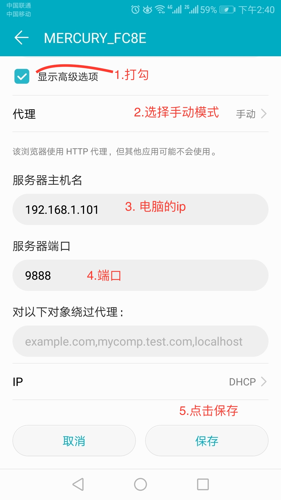

# 移动端调试
## 使用网站
- 二维码生成网站：`https://cli.im/`
- 查看本地ip `ipconfig/ifconfig`

## 本地起服务
### cli
### live-server

```shell
# 安装 
cnpm i live-server -g
# 进入需要起本地服务的项目根目录
# 启动服务
live-server
```

## 调试
### vconsole
> https://github.com/Tencent/vConsole

```javascript
// main.js
import vconsole from 'vconsole'
if(process.env.NODE_ENV === 'development'){
	new VConsole()
}
```
 
#### vconsole面板
| 面板  | 说明 |
| --- | --- |
| Log | 查看输出/程序报错 |
| System | 系统相关信息 | 
| Network | 网络请求 | 
| ELement | DOM树 |
| Storage | cookie和localstorage |

### spy-debugger
> https://github.com/wuchangming/spy-debugger

```shell
# 安装
sudo npm i spy-debugger -g
# 启动spy-debugger
spy-debugger
```

#### 设置代理
> Android设置代理步骤：设置 - WLAN - 长按选中网络 - 修改网络 - 高级 - 代理设置 - 手动

> iOS设置代理步骤：设置 - 无线局域网 - 选中网络 - HTTP代理手动



#### 手机安装证书


**提示无法识别证书等报错**
> 可以使用从SD卡安装证书

> 路径：设置->安全和隐私->从SD卡安装证书-> 找到下载的文件位置 -> 点击即可安装

## chrome控制台简单使用
- Elements
	- 查看修改元素的样式
- Console
	- console.log/warn/dir/error/info
	- 计算
	- 执行页面中的全局函数
- Sources
- Network
	- preserve log
	- 限速
- Application
	- 各种本地存储

