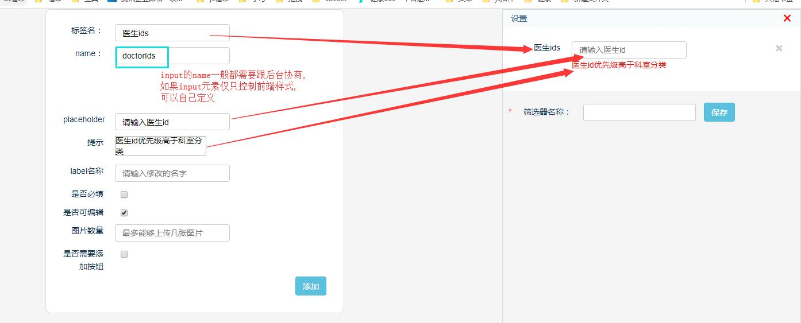
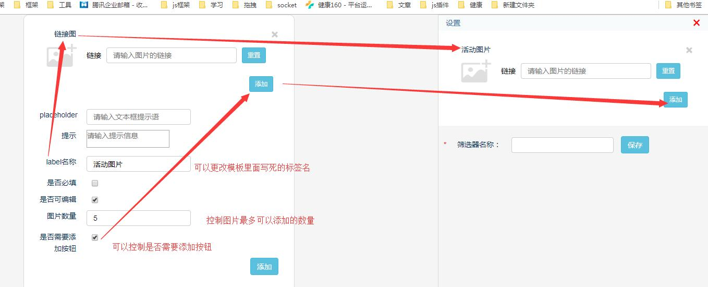
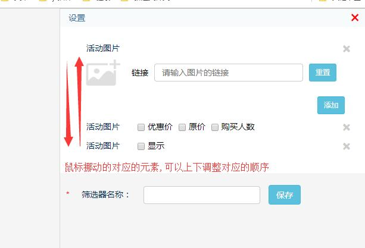
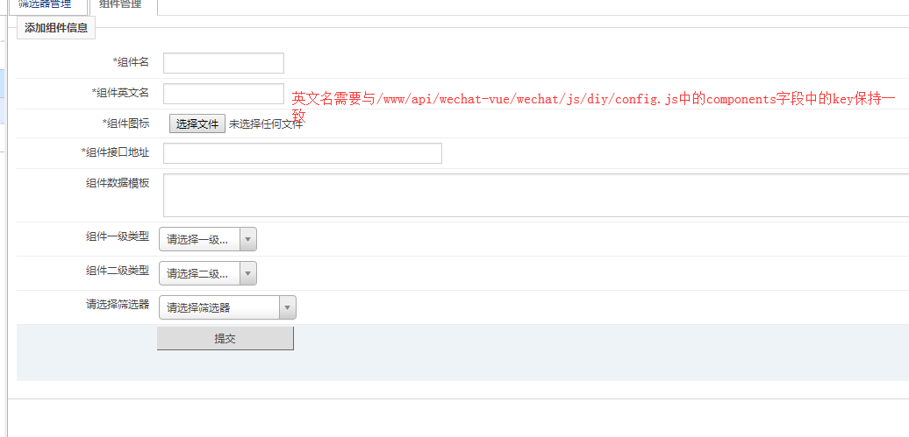
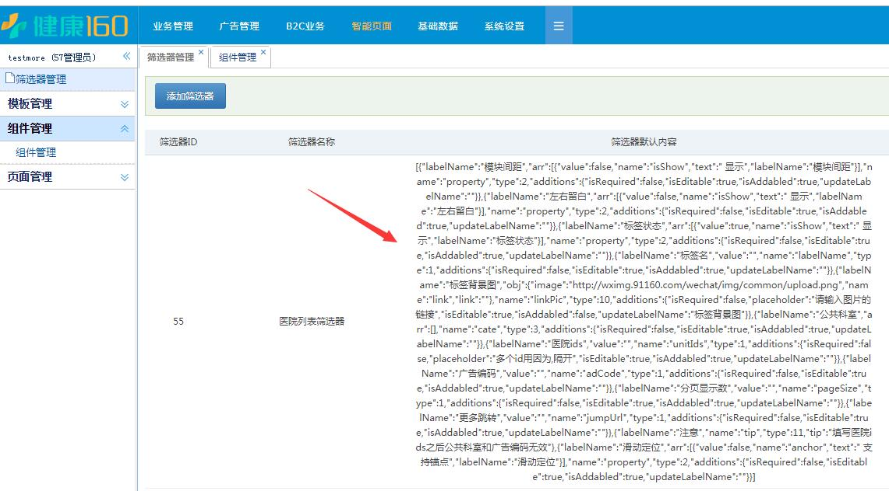

# 开发流程
## 1.样式结构
先在\www\91160-com\NykjAdmin\91160\tpl\page\setting.html写好对应的html结构以及在\www/api/wechat-vue/wechat/css/assemblynew.cssl里写好样式
## 2.创建筛选器




## 3.创建组件
注意事项:
1. 
2. 组件的接口地址和默认数据分两种情况
    - 需要后台查数据,组件接口地址找后端要,默认数据与后端协商
    - 不需要后台查数据,组件接口地址统一是[{"m":"CmsSelfApi","f":"indexInfo"}],默认数据就是创建筛选器之后保存的数据
        
## 4.配置组件对应的js文件
```
在/www/api/wechat-vue/wechat/js/diy/config.js中配置组件对应的js文件路径, @的意思在模板文件中配置过
window.GLOBALCONFIG = {
    components:{
        swiper:'@/swiper/swiper.js',
        search:'@/search/search.js',
        doctorAcross:'@/doctor/doctorAcross.js',
    }
}
```
## 5.编辑组件代码
组件的格式需要保持保持统一,方便在/www/api/wechat-vue/wechat/js/diy/firEvent.js中全局调用,这样就可以尽可能少的去了解框架其他部分的代码,
### 格式
```
define(function(require, exports, module) {
	var MicroclassFun = function(){
	}
	module.exports = MicroclassFun; // 暴露一个构造函数

	MicroclassFun.prototype = {
		init:function (obj) { // 构造函数的原型上面需要有一个init方式,用户初始化数据
		}
	}	
});
```

### 组件里面的常用代码
```
define(function(require, exports, module) {
	var edit = componentsTpl.edit;    // 编辑删除按钮
	var componentTitle = componentsTpl.component_title;  // 组件的标题
	var methods = require('../../editpage.js')   
    // 里面包含很多公共的方法,所有的组件都需要调用一下methods.initDom,会根据筛选器的配置控制组件的展示

	var MicroclassFun = function(){
		this.componentTitle = $(componentTitle);
	}
	module.exports = MicroclassFun;

	MicroclassFun.prototype = {
		init:function(obj) { // 一般所有的组件组装的逻辑,都放在这里
			obj.container.append(this.componentTitle).append($(edit));
			if(obj.assembly_content) {//如果有数据,就初始化
				methods.initDom(obj.container,obj.assembly_content)	
			}
			methods.replaceDom(obj)
		}
	}	
});
```
## 6.调试
1. 新建页面,新建页面的时候可以控制页面的分享内容,背景图,有效期
2. 排版,
    - 从左侧组件列表里面拖拽对应的组件到中间的预览区域,
    - 在对应的组件上,右键会出现编辑和删除按钮
    - 点击编辑, 自动请求接口实例化筛选器
    - 配置筛选器参数,保存,自动刷新页面