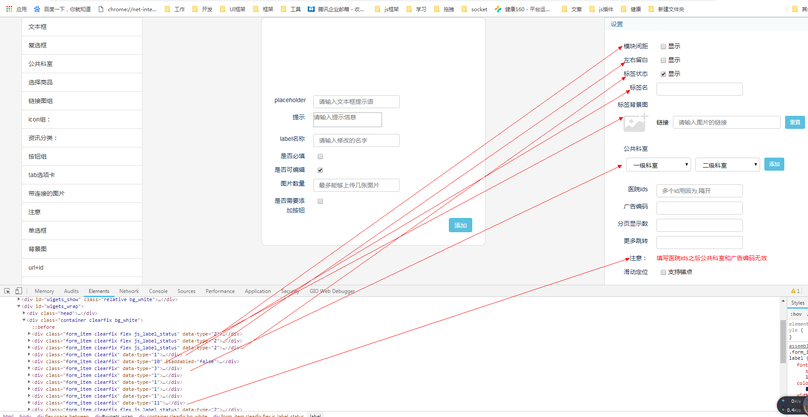

# 框架介绍
## 技术栈
### jQuery + seajs + sortable 
1. jQuery: dom操作,绑定事件
2. seajs: 组件模块按需加载   [seajs文档](https://seajs.github.io/seajs/docs/)
3. sortable: 组件拖拽   [sortable文档](https://github.com/SortableJS/Sortable)

## 项目结构
```javascript
路径: /app/wwwroot/api/wechat-vue/wechat/js/diy
│  bindEvent.js        主要负责运营后台编辑页面时候的交互事件绑定
│  components.js       公用的组件,包括每个组件的最外层元素,编辑/删除按钮,组件的标题栏
│  componet_title.js   组件的标题栏(后面优化已经整理到components.js)
│  config.js           全部的配置,包括域名,请求的接口地址
│  container.js        每个组件的最外层元素(后面优化已经整理到components.js)
│  edit.js             每个组件的编辑/删除按钮(后面优化已经整理到components.js)
│  editpage.js         控制页面的显示,包括页面组件列表库,预览区域元素控制,页面分享逻辑
│  event.js            筛选器对应的逻辑
│  fireEvent.js        通过监听对应的组件名,找到组件对应的js文件并加载然后拿到每个组件暴露的构造函数实例化
│  jquery.autocomplete.js  jquery插件,筛选器里面有的选项需要支持关键字搜索
│  jquery.min.js
│  main.js             主入口:智能页面js加载的入口,再对应的index.html中通过seajs.use('main.js')加载
│  more.js             最开始医生组件,医院组件中用于分页加载的模板文件,后面取消分页之后很少使用
│  sea.js               
│  seajs-css.js        seajs只能加载js文件,想要动态加载css文件,需要用到这个模块
│  service.js          请求接口用的公共文件
│  sort.js             处理拖拽逻辑的公共文件
│  Sortable.min.js    
│  utils.js            工具类函数库,包括(cookie操作,app拉原生,时间转换)
│  widget.js           所有筛选器的实例化的逻辑,预计筛选器数据的保存,都在这里
│
├─jquery
│      jquery.min.js
│
├─module               组件模块(所有的组件都放在module文件夹下面,实际开发只需要在这个模块修改内容)
│  ├─act
│  ├─ad
│  ├─btnGroup
│  ├─consult
│  ├─doctor
│  ├─doctorsay
│  ├─goods
│  ├─hospital
│  ├─iconGroup
│  ├─microclass
│  ├─pic
│  ├─question
│  ├─search
│  ├─swiper
│  └─tab
├─Sortable
│
└─Swiper-4.0.5
样式文件:
1. 公共的样式文件 /app/wwwroot/api/wechat-vue/wechat/css/common.css
2. 组件对应的样式 /app/wwwroot/api/wechat-vue/wechat/css/assemblynew.css
```
## seajs全局配置
配置的代码分别位于以下路径:
- 运营后台: \www\91160-com\NykjAdmin\91160\tpl\page\setting.html
- 微信: \www\api\wechat\app\Views\diycms\index.php
```javascript
两个模板文件中的配置都是类似,微信的静态资源版本号需要通过http://weixin.91160.com/main/clearCache.html?key=Joy\Web\Controllers\BaseController\afterExecuteRoute动态的清除
var version = "{$smarty.const.VERSION}";
seajs.config({
    base:"//wximg.91160.com/wechat/js/diy", // 文件加载的动态路径
    alias: {
        'sortable':'Sortable.min.js',
    },
    paths: { ///www/api/wechat-vue/wechat/js/diy/config.js中会用到@
        '@': 'module'
    },
    //文件映射
    map: [ 
        ['.js', '.js?v=' + version]
    ],
    preload:['sortable'],
    debug:true
});
```
## 筛选器介绍
筛选器是有很多个微元素交互组合而成,这些微元素包括,新建筛选器的时候,可以任意组合,如果现在的元素满足不了新组件的需求,新增对应的类型即可,对应的代码文件在app/wwwroot/api/wechat-vue/wechat/js/diy/widget.js
```javascript
{name:'文本框',domName:'text',type:1},
{name:'复选框',domName:'checkbox',type:2},
{name:'公共科室',domName:'commonSection',type:3},
{name:'选择商品',domName:'selectGoods',type:4},
{name:'链接图组',domName:'swiper',type:5},
{name:'icon组：',domName:'iconGroup',type:6},
{name:'资讯分类：',domName:'consultList',type:7},
{name:'按钮组',domName:'btnGroup',type:8},
{name:'tab选项卡',domName:'tabGroup',type:9},
{name:'带连接的图片',domName:'linkPic',type:10},
{name:'注意',domName:'tip',type:11},
{name:'单选框',domName:'radio',type:12},
{name:'背景图',domName:'bgImage',type:13},
{name:'url+id',domName:'urlId',type:14},
```
