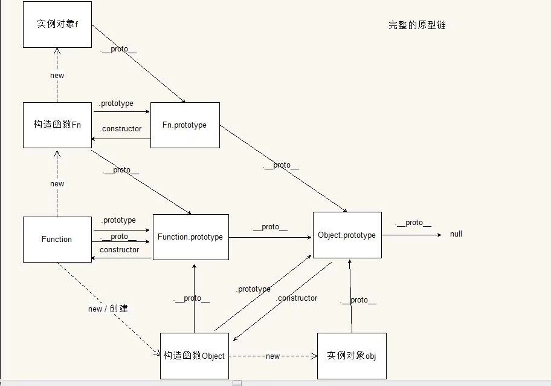

# 面向对象
## 三个基本特征  
    - 封装
    - 继承
    - 多肽

## 函数封装的问题
    - 全局污染（变量在全局范围内有效）
    - 大量的函数无法管理
    - 使得维护变得困难
```
bade code 

/*微信公众内嵌web app公共脚本*/
function pageResize(){}
var arr_scroll = [], arr_scrollwrap = $(".scroll-pagewrap");
function loaddata(){}
function showSelect(){}
function chgSelect(){}
var nav = $(".nav").length ? $(".nav") : '';
var footnav = $(".footnav").length ? $(".footnav") : '';
var scalp = $(".screen").length ? $(".screen") : '' ;
var linklist = $(".unit-list, .doc-list, .news-list, .search-dlist, uc-order-list, consult-list, ac-cs-list");
var popup, ptheight = parseInt($(".pop-title").outerHeight());
var answerheight = parseInt($(".greenanswer-title").outerHeight());
var ny_domain = window.location.host.split(".")[1] + "." + window.location.host.split(".")[2];
var dataParam = '';
var u = navigator.userAgent, app = navigator.appVersion;
var android = u.indexOf('Android') > -1 || u.indexOf('Linux') > -1; //android终端或者uc浏览器
var ios = !!u.match(/\(i[^;]+;( U;)? CPU.+Mac OS X/); //ios终端
var hasUTel = !!$(".unit-tel").length;
var codesend = 1;
//@ init
function init(){}
function getAppToken(){}
/**
 * ios滑动隐藏键盘start
 */
//判断是否为苹果
var isIPHONE = navigator.userAgent.toUpperCase().indexOf('IPHONE')!= -1;
function getUrlParam(pname) {}
// 消息滚动展示
var doscroll = function(){};
var cook_top_app_ads = $.cookieHelper('cook_top_app_ads');
var cook_bottom_app_ads = $.cookieHelper('cook_bottom_app_ads');
function pullUpNativeDoc (unit_id,dep_id,doctor_id,type){ //拉取原生} 
function compressImage(file, callback) {//canvas压缩图片});
```
```
better code 

var NYKJ = {
    getAppToken: function() {},
    showTips: function(tagStr) {}
};

```
#### 函数封装的原则
    1.单一职责(高类聚, 低耦合)
    2.健壮、安全(默认参数, 异常捕获)
```
参数过多
function (a, b, c, d, e, ...) {}
建议
function ({a: 1, b: 1}) {}
异常捕获
function a (str) {
    var str1 = JSON.parse(str) // params不是JSON字符串会报错
}
a(1);

function b (arr) {
    arr.forEach(() => {...}) // params不是数据的时候会报错
}
b(1)
b()

建议
1.危险操作使用try catch 
function a (str) {
    try {
        var str1 = JSON.parse(str) // params不是JSON字符串会报错
    } catch (err) {
        console.log(err)
    }
}
2.api操作需要需要先做类型判断或者给默认值
function b (arr) {
    if(Object.prototype.toString.call(arr) === '[object Array]') {
        arr.forEach(() => {...}) // params不是数据的时候会报错
    }else {
        return arr;
    }
}
```
#### 函数的返回值
```
function a () {
    var str = 1;
}
function b () {
    var str = 1;
    return str;
}
function c () {
    var str = 1;
    setTimeout(function() {
        return str;
    },200)
}   

function C () {
    this.a = 1;
} 
console.log(new C());

function C () {
    this.a = 1;
    return {
        a: 3
    }
} 
console.log(new C())

function C () {
    this.a = 1;
    return 3
} 
console.log(new C())
```
#### 函数的调用形式
    - 函数调用模式 this 指向 window  事件回调函数,
    - 方法调用模式(函数作为某个对象的属性被调用) this指向调用方法的对象
    - 构造函数调用模式 this指向新创建出来的对象
    - 借用方法调用模式(上下文调用模式,call,apply) this指向指定的对象

#### 通过new 关键字调用函数和直接调用函数的区别
    ```
        var Person = function () {
            this.str = 1;
        }
        Person.prototype = {
            constructor: Person,
            sayHi: function () {
                console.log(1)
            }
        }
        var person = new Person();

        1. 创建一个新的对象
        2. 将所创建对象的__proto__属性值设成构造函数的prototype属性值
        3. 将构造函数内部的上下文指向这个对象,执行构造函数内部的代码, 设置这个新的对象的属性
        3. 隐式的返回 this
    ```

## 继承
    子类可以使用从父类继承的属性和方法
### 继承的方式
#### 经典继承 - Object.create
```
var o1 = { 
    sayHi: function() {
        alert("hello world");
    }
};

var o2 = Object.create(o1);
o2.sayHi();
```
####  原型继承 - Object.prototype
```
var Person = function () {
    this.str = 1;
}
Person.prototype = {
    constructor: Person,
    sayHi: function () {
        console.log(1)
    }
}
var person = new Person();
person.sayHi()

构造函数: Person
原型对象: Person.prototype
实例对象:person
constructor: 指向对象的构造函数（person.constructor === Person）
person.__proto__ === Person.prototype

规范

所有属性和数据放在构造函数中
所有的方法放在原型中

jquery.autocomplete.js
```

## 函数的创建方式
```
1. var test = function () {} // 函数表达式
2. function test() // 函数申明
3. var test = new Function('n1','n2','return n1+n2') // 最后一个参数是函数体,其他的都是参数
```
所有的函数都可以理解为是通过Function创造出来的,包括Array, Object
```
    var test = function () {} 
    test.__proto__ === Function.prototype
    Array.__proto__ === Function.prototype
```

## 原型链
    - 对象有原型对象，原型对象也是对象，所以，原型对象也有原型对象，这样一环扣一环，就形成了一条链式结构，叫做：原型链
    - 原型链结构的最上层是 Object.prototype，任何对象都直接或间接的继承自 Object.prototype
    - 属性查找顺序:从任何一个对象自身查找,找到了就直接返回,找不到再去该对象的原型上找,找到了直接返回,找不到再去该对象的原型对象的原型对象上面去找,一直往上找直到null
```
var obj = {
    name: '111',
}
// var obj = new Object()
Object.prototype.name = '222';
Object.prototype.sex = '男';
console.log(obj.name)
console.log(obj.sex)

```


